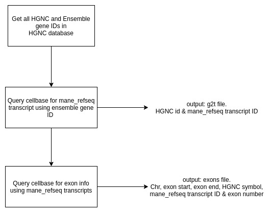

# Cellbase_annotation

Two scripts, cellbase5_g2t and cellbase5_exons, use cellbase v5 to query HGNC ids for mane_select_refseq transcripts. The HGNC_210902 file containing HGNC IDs is pulled from  https://www.genenames.org/download/custom/

This is designed to produce the required files to generate Athena reports for Dias.

### Limitations
 - Can only use HGNC ids
 - Only mane_select_refseq transcripts are pulled
 - For exons, the genomic coding regions of exons are selected

